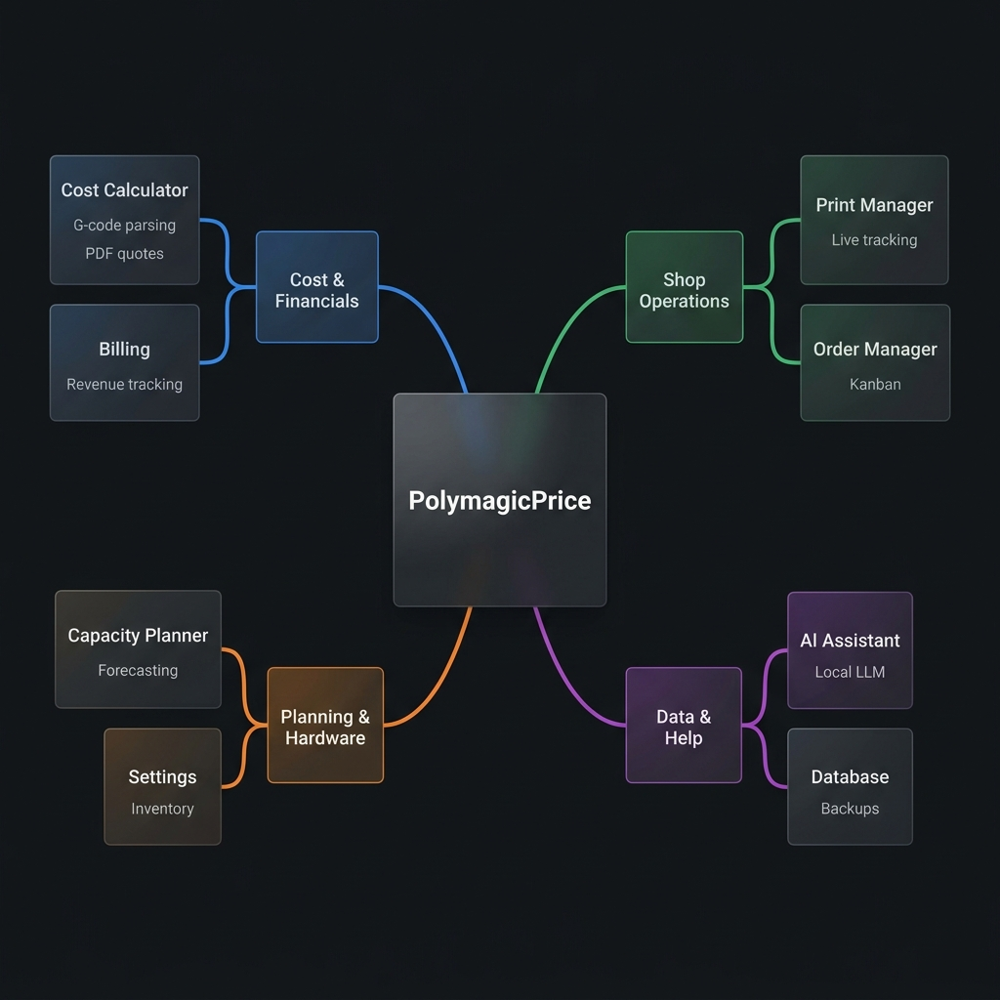
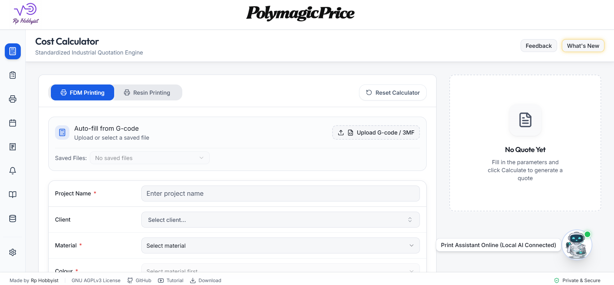
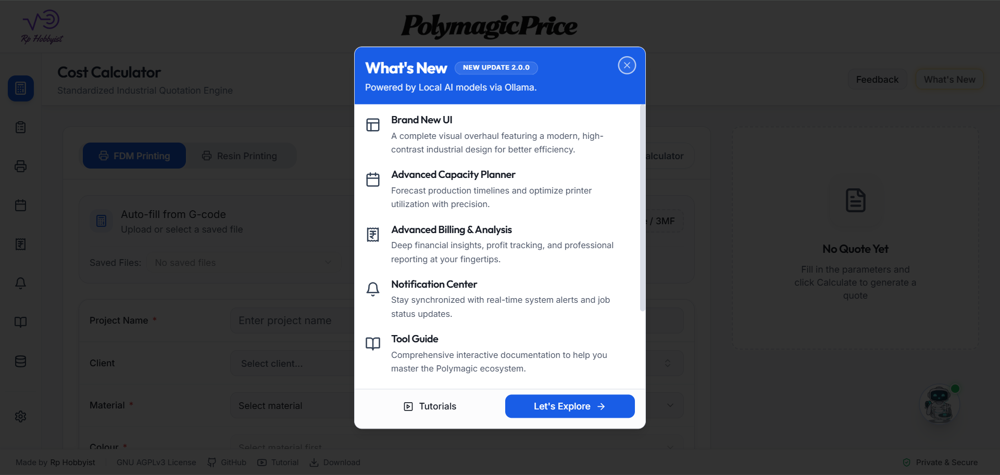
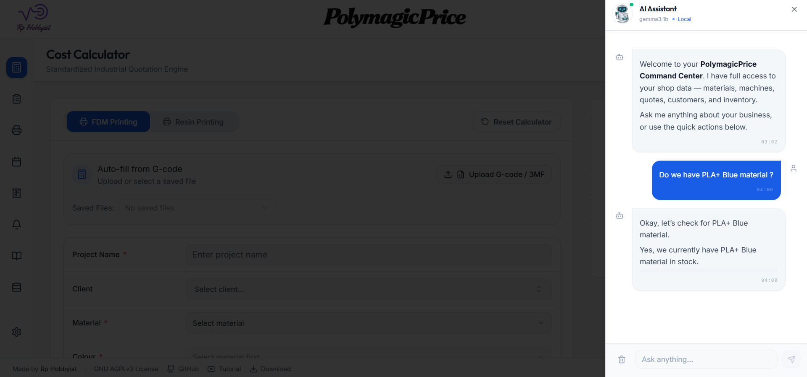

# PolymagicPrice v2.0.0

<div align="center">
  
  <br>
  

  [](https://www.gnu.org/licenses/agpl-3.0)
  [](https://github.com/RPHobbyist/PolymagicPrice/releases)
  [](https://www.rphobbyist.com)
  [](https://polymagicprice.rphobbyist.com)
  [](https://www.youtube.com/playlist?list=PLwLQ_Xr7StXiMV7_xrYweyu3AdNJex-H9)

  ### **Professional 3D Printing Quotes, Simplified and Free**
  *The ultimate cost estimator and shop management command center for FDM and Resin printing.*

  [🌐 Use Online](https://polymagicprice.rphobbyist.com/) | [💻 Download Desktop App](https://github.com/RPHobbyist/PolymagicPrice/releases) | [📺 YouTube Tutorial](https://www.youtube.com/playlist?list=PLwLQ_Xr7StXiMV7_xrYweyu3AdNJex-H9)
</div>

---

<p align="center">
  <a href="https://www.youtube.com/watch?v=PvxaYkOh6-M">
    
  </a>
  <br>
  <i>Watch the Launch Trailer of PolymagicPrice v.2.0.0</i>
</p>

---

## 🏢 About PolymagicPrice

<div style="text-align: justify;">
<strong>PolymagicPrice</strong> is the premier <strong>3D printing price calculator</strong> and <strong>print farm management</strong> ecosystem designed for professionals, makers, and hobbyists. This local-first <strong>3D print cost estimator</strong> utilizes precise industrial formulas for **FDM (Filament)** and **Resin (SLA/DLP)** pricing, accurately accounting for material weight, electricity consumption, machine depreciation, and labor overhead. 

Whether you are scaling an Etsy shop or managing an industrial-grade print farm, PolymagicPrice streamlines your workflow with **IoT printer integration**, a **Production Kanban board**, and a built-in **Customer CRM**. Designed with a "Privacy First" philosophy, it keeps all your sensitive business data offline while leveraging **Local AI insights** for smart quoting and shop analytics.
</div>

<br>



---

## 📈 Trusted by the Maker Community

<p align="center">
  
  <i>Over 10,000 community interactions and growing!</i>
</p>

---

## 🚀 What's New in Version 2.0?

The v2.0 update introduces a complete visual overhaul and a suite of "Command Center" features.

<p align="center">
  
  
</p>

### 🛠️ Key Capabilities

#### **💰 Precise Pricing & Quoting**
- **✨ Smart Auto-Fill**: Drag-and-drop `.gcode`, `.3mf`, or `.cxdlpv4` files to instantly extract print time, weight, and volume.
- **⚖️ Dual Technology Engine**: dedicated calculators for **FDM** (PLA, PETG, ABS, etc.) and **Resin** (SLA/DLP/LCD).
- **📊 Quote Dashboard**: A unified hub to save, view, and export professional quotes for your clients.
- **🖼️ 3D Thumbnail Previews**: High-fidelity visual previews of your uploaded 3D printing jobs.

#### **🏭 Shop & Fleet Management**
- **🖨️ Printer Manager**: Real-time status tracking for your entire printer fleet (Online & Offline).
- **📋 Production Kanban**: A visual drag-and-drop board to manage jobs from "Pending" to "Shipped."
- **📅 Capacity Planner**: Accurate production forecasting and machine utilization optimization.
- **📦 Inventory Management**: Live tracking for filaments, resins, and consumables (gloves, IPA, FEP).
- **👥 Integrated CRM**: Manage customer profiles, contact info, and complete order histories.

#### **🔒 Edge Intelligence & Security**
- **🤖 Local AI Assistant**: Powered by **Ollama**, get deep insights into your shop profitability without cloud data leaks.
- **🛡️ Industrial Hardening**: All data is stored locally with OS-native **256-bit encryption** for sensitive printer keys.
- **📈 Advanced Analytics**: Interactive charts for revenue tracking, material trends, and profit margins.

---

## 🛠️ Technical Specifications

- **Parser Support**: Native extraction for `.gcode`, `.3mf`, and `.cxdlpv4` metadata.
- **Printer Integration**: Real-time monitoring for **Bambu Lab** printers via MQTT.
- **Slicer Support**: Direct integration with **OrcaSlicer** & **BambuStudio** via Polymagic Bridge.
- **Platform**: Cross-platform desktop performance via **Electron** and mobile-responsive web via **Shadcn UI**.

---

## 🤖 Powered by Local AI (Ollama)

Privacy-first intelligence. Connect your local **Ollama** instance to get instant insights into your shop data.



- **Natural Language Queries**: Ask "Which material is my most profitable?" or "What is my average print time?"
- **Sanitized Context**: AI metadata is encapsulated and sanitized locally to prevent prompt injection.

---

## 🚀 Get Started

### 🖥️ Run Locally
```bash
# Clone the repository
git clone https://github.com/RPHobbyist/PolymagicPrice
cd PolymagicPrice

# Install dependencies
npm install

# Start development server
npm run dev
```

### 📦 Build for Production
```bash
npm run build
```

---

<div align="center">
  Made by <strong><a href="https://www.rphobbyist.com">RP Hobbyist</a></strong>
  <br>
  <em>Empowering makers with professional-grade tools.</em>
</div>
